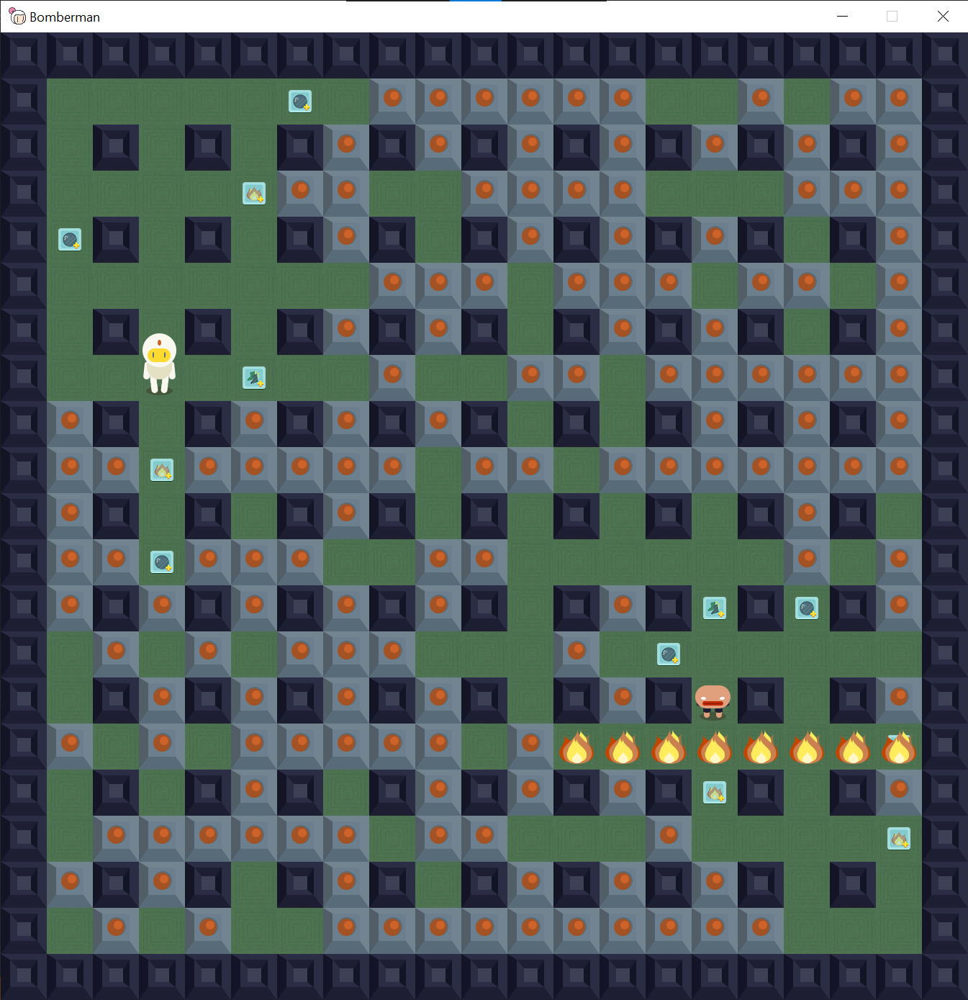

# Bomberman

**Bomberman** is a implementation of [a popular, arcade game](https://en.wikipedia.org/wiki/Bomberman).<br />
The following implementation is a multiplayer version of **Bomberman** game in which **two players** can play agains each other.


## Technologies

* C++
* [SFML - Simple and Fast Multimedia Library](https://github.com/SFML/SFML)
* [Entity-x - EntityX - A fast, type-safe C++ Entity-Component system](https://github.com/alecthomas/entityx)


## Installation

### Windows

#### Dependencies

Install the dependencies using [microsoft/vcpkg - C++ Library Manager for Windows, Linux, and MacOS](https://github.com/microsoft/vcpkg).

```sh
$ vcpkg install sfml:x64-windows
$ vcpkg install entityx:x64-windows
```

##### Repository

```sh
$ git clone https://github.com/marmal95/Bomberman-Game.git
```

##### Build

Open **Visual Studio** and **Build Project**.<br />


### Linux

#### Dependencies

##### Arch

```sh
sudo pacman -S entityx
sudo pacman -S sfml
```

##### Other distros

Please follow **installation guide** on **SFML** and **entityx** GitHub pages.

#### Repository

```sh
$ git clone https://github.com/marmal95/Bomberman-Game.git
```

##### Build

```sh
cd Bomberman-Game
mkdir build && cd build
cmake ..
make
```

## Resources

The following resources were used in the project:
- Sprites freely available on: https://gamedevelopment.tutsplus.com/articles/enjoy-these-totally-free-bomberman-inspired-sprites--gamedev-8541
- Icon freely available on: https://www.flaticon.com/free-icon/bomberman_528079


## Screenshots


